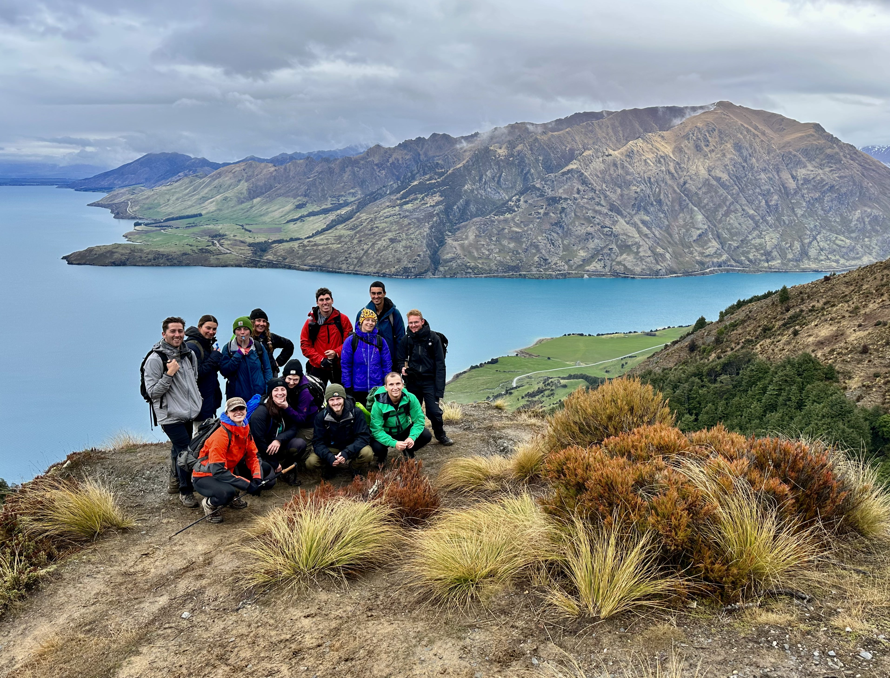

We woke up at 6 a.m., packed our bags, and set off by 7 a.m. to beat the rain. After a demanding five-hour descent, we paused briefly to hydrate and grab a quick bite. The moment my backpack hit the ground, Adam, our head instructor, declared, "Okay, everyone, compasses out --let's shoot a bearing."

This snapshot effectively encapsulates the intensity of our three-month outdoor education program. Whenever we were not tramping or climbing rocks, we practiced what we had learned during class: tying knots, studying the native fauna and flora, and figuring out how to find our way in the backcountry.

If fortunate, we would have one rest day a week to recharge. Intense? Absolutely. Worth it? Unquestionably. This was one of the most meaningful investments I have made in myself. Let's dig in.

## What was I up to?

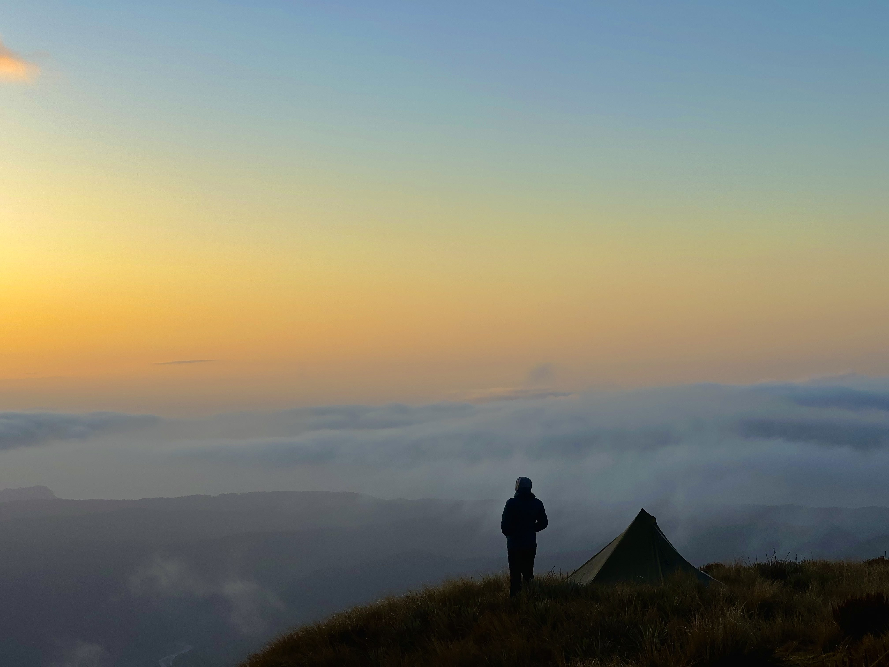

At the start of 2022, I began to reconsider my career as a developer. I wanted a role that was physical, including human interaction and nature. One thing led to another, and by June, I had enrolled in a [three-month adventure guide course](https://www.pureexploration.nz/adventure-guide-programs/oceania/adventure-guide-program-new-zealand/) in Queenstown, New Zealand for the fall of 2022. Working as a mountain guide sounded like exactly what I was looking for.

We predominantly spent our days rock climbing and tramping, with a brief introduction to swift water rescue and a week devoted to pre-hospital emergency care. Each module got progressively more challenging, enriching our skill set substantially. I transitioned from having little to no experience in rock climbing to cleaning anchors, abseiling, and even some lead climbing. We started with easy day hikes in the first week and escalated to bush-bashing on technical terrains by the fourth week.

The last three weeks were all about engaging with real clients, practicing our leadership skills, and preparing for the final assessments--heaps of learning in the span of three months.

## Pre-program

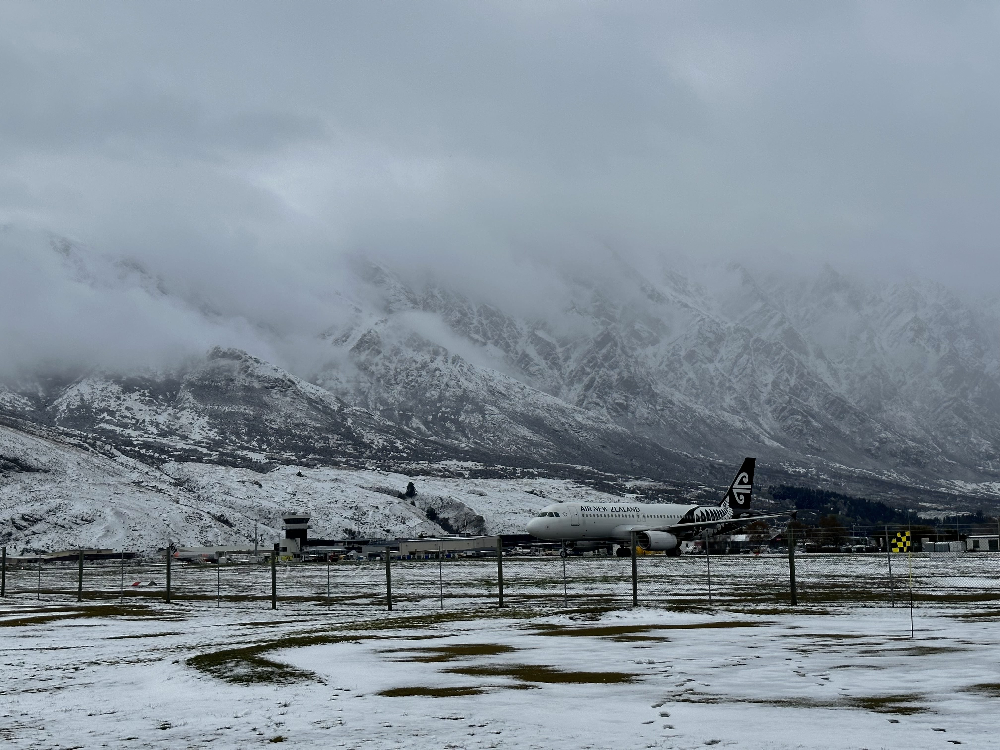

In the weeks leading up to my departure, I shifted my intention from seeking a new career to embracing whatever experiences would come my way. I anticipated a wave of new impressions, considerable time spent in nature, and a physically demanding journey. I knew that there would be more to this program than finding a new occupation; personal growth would be equally, if not more, significant than mastering outdoor skills.

After two days of travel, I arrived in Queenstown just in time for the course to begin. Fueled by an open mind and abundant energy, I was eager for the months ahead. The last time I felt this level of excitement was when I moved to Sweden in 2017. I thought I was ready -- or so I believed.

## Embracing discomfort

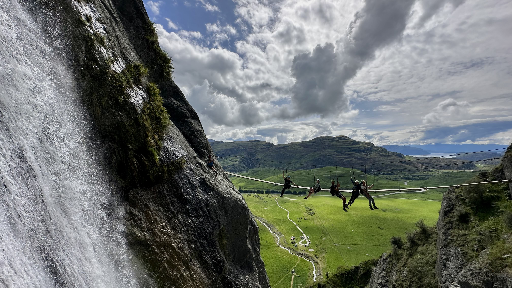

Picture this: twelve strangers in their mid-twenties, one house, seven bedrooms, and communal living spaces. For the next three months, we are going to live and spend most of our waking time together. Efficiency is key, so we form cooking groups to stretch our limited budget. I am in a country at the other end of the world. There are gonna be lots of new stimuli. Outside, winter persists. I will forgo personal space for months, and to top this up, I am fighting jet lag and my sleep is a hot mess.

I will never forget the early mornings when I woke up at 5 a.m., and my thoughts were going into dark places. I had not felt anxiety at that intensity in ages. It seemed as if all the comforts of my previous life ,  habits, close ones, motivation , had vanished.

But instead of succumbing to these thoughts, I confronted them. I named each one in my journal and came up with a solution. It made me feel better for a few hours, but the day began, and my mind felt chaotic again. Yet, I did not resist it. I decided to go with the flow, expect nothing, and let the present guide me. I welcomed the uncertainty, allowing space for whatever would come, and simply rolled with it.

## The first few weeks

It took me some time to acclimate to both the group and the program. Various excuses preoccupied my mind, questioning my presence: "I am too old for this group", "I have nothing in common with these people", and "Why start from scratch when I already have a fulfilling life?" These thoughts would persistently surface.

Fortunately, each time these doubts arose, I managed to center myself in the present moment. I reminded myself that I was reevaluating my career, grateful for this opportunity, and committed to maximizing these three months.

Over time, this mindset worked. I began to relax, lowered my guard, and was showing up as my authentic self.

## A glimpse into a typical week

Each week alternated between climbing and hiking modules. We would depart from our Queenstown base on Monday mornings(occasionally leaving on Sunday to capitalize on favorable weather) and return by Friday afternoons.

Preparation for hiking weeks was intense. Weekends were devoted to planning the trek, choosing camping locations, and crafting meal plans. Sundays were usually consumed by this planning.

My alarm rang at 6 a.m., and after a quick breakfast, we were off to the trek's starting point. Daily walks lasted 6--10 hours, and nights were spent in either tents or mountain huts. On-the-go education was constant, covering local fauna and flora, map reading, and compass use; each of us taking turns serving as the lead guide.

Despite having little background in overnight backpacking, I thoroughly enjoyed it. The experience of carrying a heavy backpack, rationing food, and being in pristine nature with a like-minded group was incredible. I knew I wanted more of this in my life.

Climbing weeks were primarily spent in Wānaka, one of New Zealand's prime rock-climbing spots. Days began at the crag and lasted until late afternoon. While the climbing was a focal point, our instructors also emphasized safety and rope skills, ranging from setting up top ropes to mastering various knots and hitches.

Personally, the climbing modules posed a steeper learning curve. It took some time to feel comfortable with climbing and even longer to master the rope skills. Nonetheless, I am pleased with my progress, especially considering my lack of initial experience. Climbing is a foundational outdoor skill, and I am confident it will come in handy in my future mountaineering endeavors.

## Group dynamics

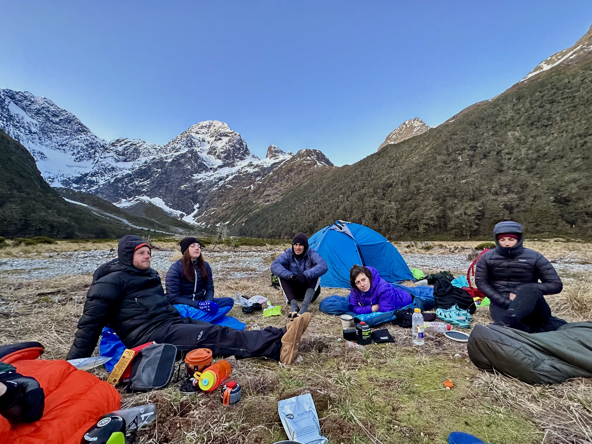

When you throw 12 strangers together in a shared house for 3 months, lots of interesting things can happen. Fortunately, I would say we did pretty well. For starters, we did not kill each other, and that's a win! Jokes aside, this experience offered valuable insights for all of us.

### Accepting people

There is a famous quote that says "You can not choose your family, but you can choose your friends". Our group was like a family for three months, and the best outcome for all of us was to accept everyone as they were. By complaining about a given behavior, especially behind someone's back, one only wastes their energy and creates tension.

I adopted a fundamental belief a few years ago: people generally aim to do the right thing. Malice is rarely intentional. They are doing their best in that moment, and that's alright. If I disagree, I can and should express my thoughts. However, I shouldn't expect an immediate change. The only thing I have control over is my perspective on the matter.

If an issue becomes substantial enough, more voices will join the feedback loop, hopefully leading to self-reflection. Failing that, involving additional decision-makers is always an option.

I advocate for respecting each individual's strengths and weaknesses, accepting them as they are, and employing nonviolent communication to navigate differing viewpoints. At times, agreeing to disagree is the best path forward. If everyone had the same thoughts, the world would be a dull place to exist in.

## Takeaways

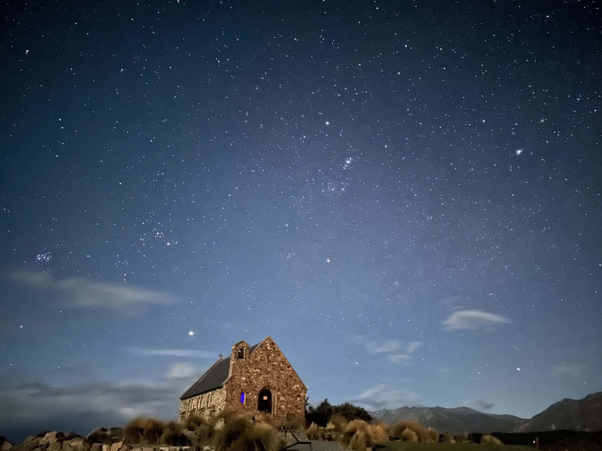

### Appreciating what I have

I journaled a lot during this time. One of my favorite activities was waking up early, heading to the local coffee shop, opening up Notion on my phone, and jotting down thoughts. I had plenty to think about, given all the new experiences and the stunning nature around me. I quickly realized that what I have built up over the years is pretty darn good.

My core values are community, agency, and health. I am already living by these by having awesome friends, a profession that not only allows me to exercise my agency but also is mentally stimulating, and I put a strong focus on my well-being. So, what is missing?

I am still working this one out; it is a tough question. One theory that has crossed my mind is a lack of commitment -- trying to do everything. It has worked so far, given my youth. To really figure out what you want in life, you've got to dabble in different areas.

I feel like I am starting to nail down the direction I want to go in. Outdoor adventures, writing, photography, health, impactful work, and surrounding myself with kind people --these three months have allowed me to think deeply about my interests and narrow down the long list to the items that I value the most.

I am ready to dive into new projects, team up with smart folks, and tackle some fun challenges. Whether it is in wellness, education, the outdoors, or the Web3 space, I am looking for projects that resonate with my core values.

### Nature in my backyard makes me happy

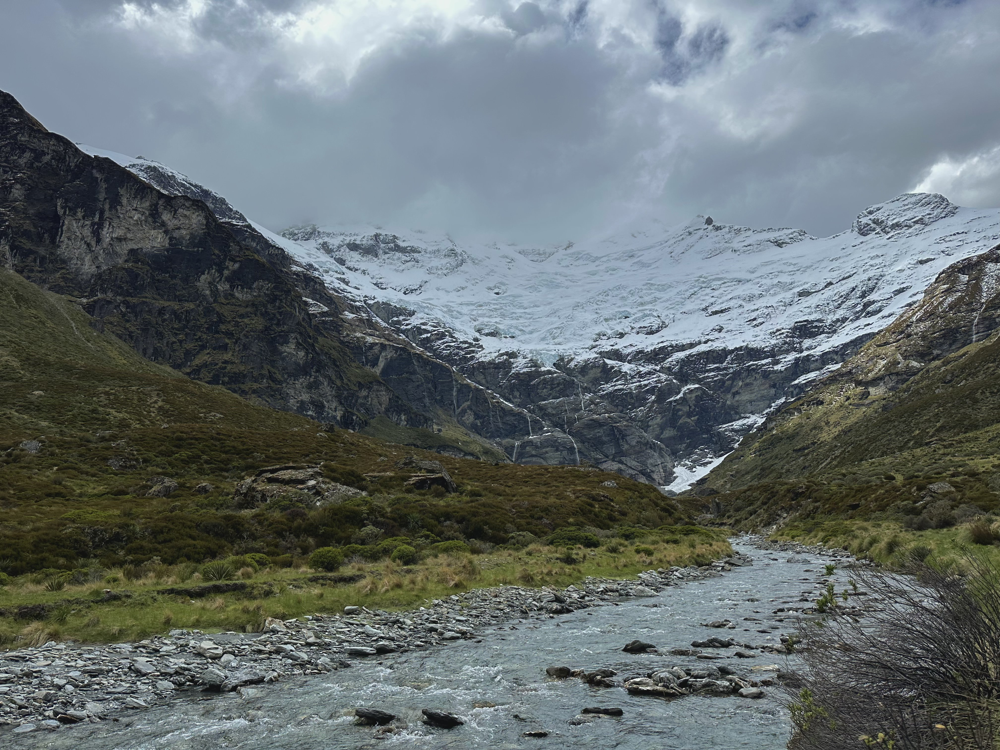

There is something special about being out in the bush. The sounds of the birds, the scent of the plants, and the glorious peaks make me feel at peace. I love walking in the forest, climbing up hills, and enjoying the simplicity of repetitive meals in nature.

Time in the woods teaches me to appreciate life's basics: dry clothes, rudimentary shelter, and a warm meal after a long day's trek. After each week of tramping, returning to civilization feels surreal. Suddenly, we have a plethora of choices -- no need to ration food, the ability to indulge in fresh produce, and the luxury of sleeping on a proper mattress! These are things we often take for granted. Backpacking resets this perspective, making me grateful for the comforts of modern living.

Cell phone reception was nonexistent during our excursions, so my phone served solely as a camera. No social media, emails, or news updates. This disconnection allowed me to fully engage with my surroundings and the people I was with.

I yearn for more of these outdoor experiences. I feel happy and at peace whenever I am outdoors. The challenge lies in incorporating them into my life on a larger scale and finding like-minded people to share these adventures with.

### Being OK with missing out

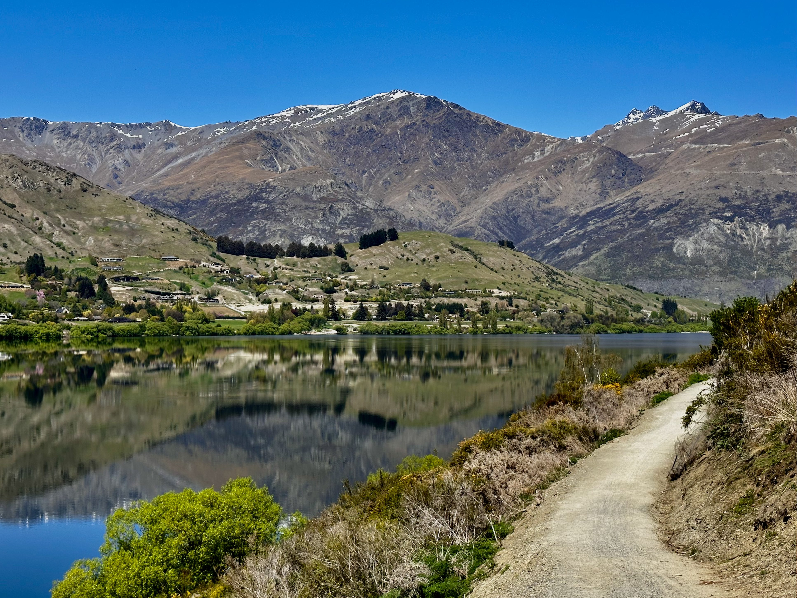

I mentioned briefly that I want to do it all: learn every sport, read all the books, and live in a new place every few months. While this is doable, it's also exhausting and keeps me at a superficial level. Excelling in a sport, nurturing deep relationships, and gaining comprehensive knowledge in a subject all demand focus.

I am inherently curious, which fuels my desire to learn about everything. However, I am now choosing to concentrate on a few areas for deeper development. My primary focus going forward will be on nurturing existing friendships, becoming proficient in mountain activities like backcountry skiing, mountaineering, and backpacking, and growing as a developer.

Rather than adding more to my life, I will consider what I can eliminate. Removing elements that no longer serve me feels incredibly freeing.

### Embracing failure

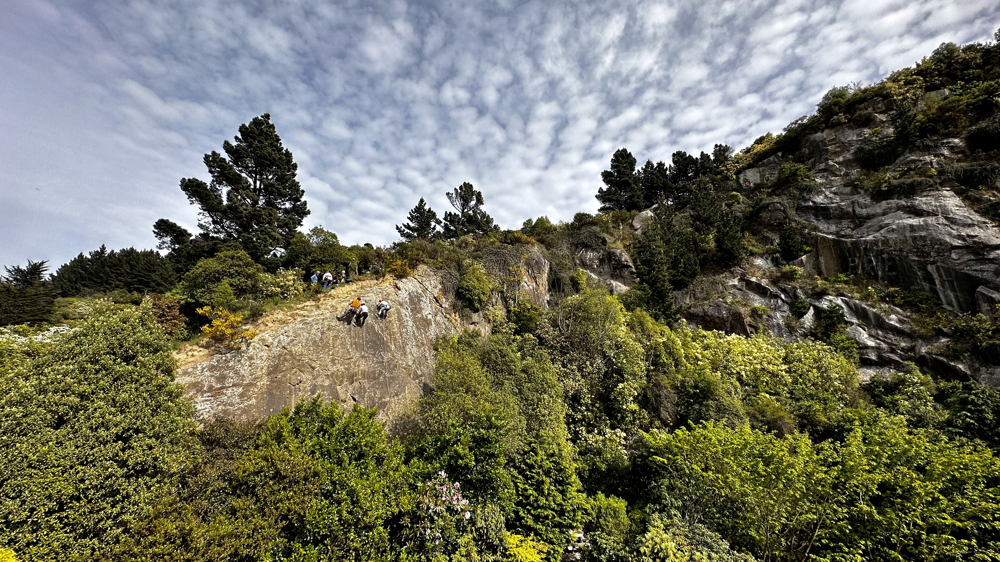

Little did I know that the program's conclusion would offer one of its most valuable lessons: the importance of embracing failure, learning from it, and ceasing to compare myself to others.

Grasping new concepts usually requires time and repetition for me. This was no different in rock climbing. From struggling with knots to overcoming my fear of heights and finally learning to instruct clients, the challenges were numerous.

Seeing my mates' rapid progress fueled my self-doubt. What if I fail the final exam? I worked extra hard practicing all the systems, improving my technique, and preparing extensively for the final test. Although my hard work led to strong performance on most of the exam, two mistakes cost me the certificate. Hearing the assessor declare my failure was a blow to my ego. The question "How could I possibly fail?" reverberated in my mind.

It did not help that, among the 20 of us, I was the only one who failed. Walking into the final dinner, where everyone else celebrated their success, was difficult. I felt stupid, isolated, and reluctant to talk about my failure. It was also our last night together, and the next day I would be closing this chapter of my life.

I held back my emotions all day, eagerly awaiting a moment to be alone and release them. When the three of us got home earlier that night, I could no longer hold back and tears started to flow. Both of my friends were incredibly supportive, and their presence helped me express my feelings.

This failure served as a profound lesson in the value of dedication and the significance of the journey over the destination. While I may not have earned the certificate, it does not negate the skills I have gained and the progress I made in rock climbing. No one can take that away from me.

## Reflections on Pure Exploration

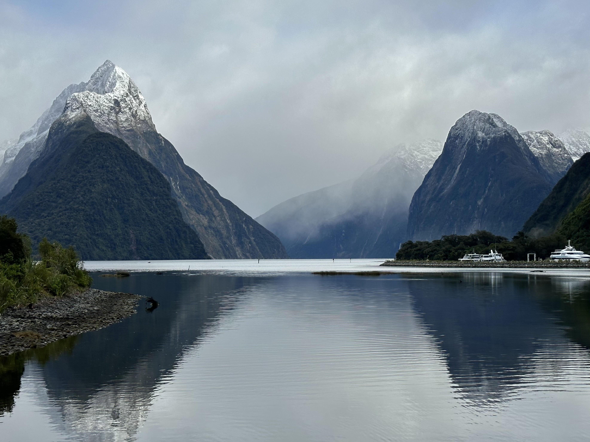

This post wouldn not be complete without discussing **Pure Exploration**, the New Zealand-based company that organized the trip. They have over five years of experience running tours primarily in New Zealand, with additional excursions in Nepal, Patagonia, and Europe.

The program itself is stellar, offering invaluable personal development, outdoor skills, and opportunities for making lifelong memories. However, like many businesses, Pure Exploration faced significant challenges during the pandemic. This led to problematic management decisions including not informing participants of program cancellations, refusing refunds when courses were dropped, and admitting participants with pre-existing health conditions only to abandon them later.

Additional concerns included a meager $46 per person food budget for five days, transportation issues to/from our PHEC course, and client days already on our second week of rock climbing to their sister company.

Most of these issues likely stem from the financial constraints and miscommunication that the company experienced during the pandemic. Nonetheless, these practices affect a vulnerable target audience --young people who often invest significant savings to join the program, which costs into the low five figures in US dollars.

On a hopeful note, there is new management in place that's keenly aware of these issues. They have been actively seeking feedback during and after the program, so improvements should be underway in the coming months. And it is worth highlighting that the program was generally well-executed; our instructors, Adam and Maddie, were fantastic guides and awesome human beings, with lots of knowledge about the outdoors.

Despite some hiccups, I would still recommend [Pure Exploration](https://pureexploration.nz/). The program is well-designed, educational, and you will have the the opportunity to explore some incredible places.

## A few months after the program

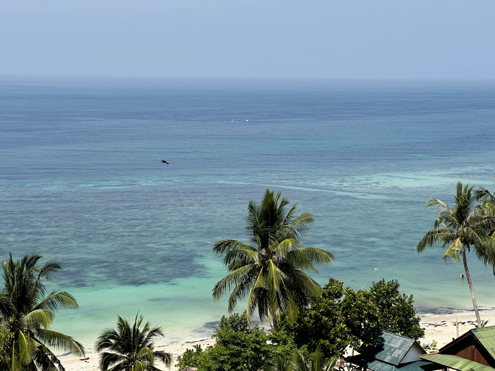

As I write this from the picturesque Ko Pha-ngan in Thailand, it has been almost two months since the program ended. I can now say with certainty that spending those three months in NZ was special, fulfilling, and life-changing.

The experience was a rich blend of mountains, challenges, joy, long, yet peaceful days in the backcountry, moments of failure, self-reflection, and personal growth. There is not a single aspect I would change.

I miss rock climbing, sleeping under the stars, the walks around Queenstown, the energy of living with 11 people, and a myriad of other things. The program wasn not without difficulties, but that is part of life's duality. We grow by confronting and learning from them.

This adventure has significantly enriched my perspective on life. It has strengthened my commitment to embracing the present moment and appreciating the people who surround me. I am deeply grateful for every facet of this transformative experience.

## Considering joining a program?

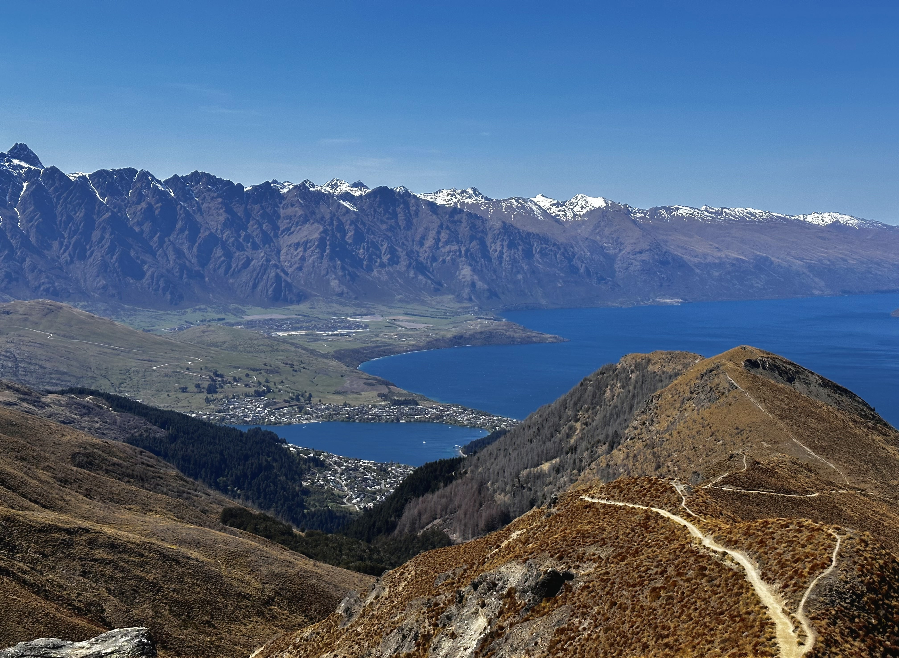

If you have a few months to spare, a desire to learn about the outdoors, and want to immerse yourself in a different culture, then go for it. Approached with the right mindset, could become an invaluable investment in yourself.

Enter with a specific intention but remain open to the unexpected. Carve out time for solitary reflection. Keep a journal of your experiences. Observe the parts that you struggle with. Learn to let go. You'll initially share this journey with strangers who will soon become close friends. You will disagree often. They will not wash the dishes. You will learn to give space. You will adapt.

Maintain an open mind and have no expectations. Allow yourself to experience the full range of emotions. Above all, be present and savor the experience.

Numerous other companies offer similar experiences. [Ski patrol courses in Canada](https://www.nonstopsnow.com/ski-patrol-courses), learn with [NOLS](https://www.nonstopsnow.com/ski-patrol-courses), or go on challenging expeditions with world-class [Adventure Consultants](https://www.adventureconsultants.com/). A year ago, I had no idea these programs existed; now, I am eager to explore more.

If you have questions about my journey, are unsure about participating, or have a story of your own to share, please reach out!
