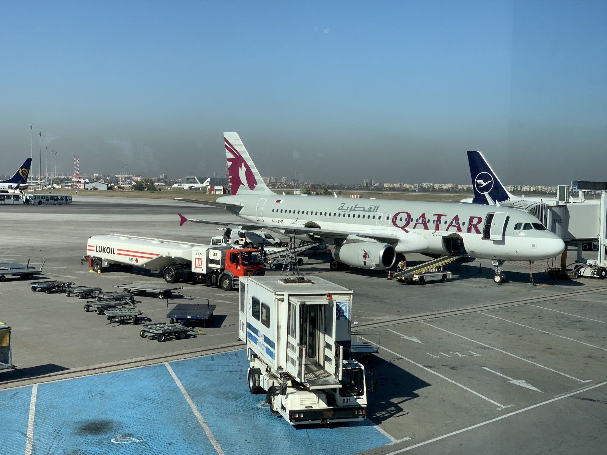

I have left my home base in Stockholm Sweden in October 2019 to become a full-time traveler and digital nomad. The last 3 years have been intense, filled with lots of adventures, incredible people, and many challenges to overcome.

I have lived in 11 countries, from big cities to beach towns and small villages. I stayed in co-livings, traveled with [WiFi tribe](https://wifitribe.co/chapter-calendar/), rented apartments in nomad hotspots, and ventured off the beaten track.

How does it feel to change locations frequently? Can you even focus on work? Does it get lonely? When do you want to stop? Are you happy?

These are only some of the questions I've received from friends and family. On social media, we tend to highlight only the positive side, and I am guilty of this too. It kinda makes sense though, as who has the energy to share publicly when they feel down? The goal of this post is to give you an in-depth overview of my lifestyle, including the not-so-fun side of it.

## A typical week

My weeks look pretty much the same all the time, with the only difference being the type of activities I do in my free time. My friend, Thomas, gave [great advice on productivity](https://twitter.com/thomasrtgoss/status/1425411730587463683), with the punchline of working during the week and taking the whole weekend off.

From Monday to Friday, I like to do routine stuff. Exercising, working, cooking, reading, being social, etc. There is no reason to rush checking out everything on the first days, as I am traveling at a slower pace. The weekend is when most of the fun happens. That's when I like to shut my computer and be out all day exploring.

Focusing on work is super important, and I always try to put it as my top priority. If I can't get things done while on the road, this whole lifestyle would fail to work. Apart from the obvious, financials, I feel the need to create and exhaust my mind.

## The good

### The people

By far my favorite part of this lifestyle is the sheer amount of fascinating people I meet and the connections we have. Being a digital nomad poses lots of challenges and this attracts a certain type of personality. Problem-solving, adventurous, growth-oriented, and focusing on holistic health are traits most nomads have.

Hearing from a person with experience about a topic is far more powerful than reading about it. Nomads are curious minds and I have the privilege to get exposed to a smorgasbord of ideas, pick the ones that resonate, and apply them to my own life.

We know from the moment we meet that our time is going to end soon, hence we jump straight into the deep topics. Seeing each other every day and having adventures makes it easy for connections to develop.

The coolest part of it? We bump into each other in different locations all over the world and continue our relationship where we left off.

### Change of scenery

I like staying in a city for 4--10 weeks at times. Having an end date makes me conscious of the experience I want to have there. I am aware from day one that it is going to end soon.

My day-to-day life is shaken up and I am forced to figure out the logistics _again_. The people I hang out with change, my _office_ is different and my workouts face yet another challenge.

I am exposed to lots of new impressions and faces. Time slows down and when a month passes, it feels like a year. I have the impression that the friends I met a few weeks ago were part of my life forever.

I can be diving in a tropical climate one month, have a proper winter in a ski resort the second, and enjoy spring in a city filled with life next.

Then it ends, I move to a new location and the cycle repeats itself.

### Fresh start effect

Humans are creatures of habit, and once we acquire them, it is tough to let them go. The longer we have the habit, the harder it is. Enter the fresh start effect! According to [science](https://journals.aom.org/doi/abs/10.5465/ambpp.2016.14737abstract), we are more likely to change on temporal landmarks, like the 1st of January, the start of the month, or Mondays.

The constant change allows me to experiment with what works for me the best. If I find that a certain habit does not give me enough value, I can easily get rid of it at my next location. Let me give you a couple of examples.

Being forced to cook in France, made me realize how much I value home-cooked food. It saves me time, I feel better knowing what I eat and it is a great skill to have in life.

I fell in love with swimming thanks to the swimming pool of my Airbnb in Mexico. Since then I've taken lessons to improve my technique and tried to find a pool in every place I went to. It became one of the main ways for staying fit on the road.

By having a cozy apartment with a great work setup in Lisbon, I started working more from home. I used to hit up multiple coffee shops before which led me to feel exhausted in the evening. I still do that sometimes, but only for a couple of hours a day.

You might think changing your habits constantly is exhausting, and you'd be right. I felt the same in the beginning. Over time, it got better and I began using it to my advantage. I can adapt efficiently and faster to any situation life throws at me.

## The challenges

### Lack of stability

Constant change is exciting, but it is difficult to get used to it. The more time I spend in a given location, the more I enjoy it. I make good friends, I have my favorite café and I have found hidden gems. It starts to feel like home. And all of a sudden my time is up and it is time to move on.

I have a love and hate relationship with the last few days. Suddenly I start to appreciate the smallest detail of my life. I meet up with all my friends. I try to do one last of all my favorite activities. Just one more walk in the park, another cappuccino, and please let's go back to that amazing Nepalese restaurant.

Yes, I can return, but when? Are my friends still going to be here? It will surely be difficult to find an apartment. Why travel so much anyway?

I go through the same process every couple of months, and it is always an emotional rollercoaster.

### It can be lonely

When I started nomading, I did not have many friends living the same lifestyle. I had to build up relationships from zero all the time. Moving to a city not knowing anyone is intimidating. How do I meet people? Where? Are they gonna be cool?

Fortunately, it's easy to start out. There are co-working places in most of the locations and some of them are [great at community building](https://coworkingbansko.com/). Staying in [coliving houses](https://cloudcitadel.co/) will give you an instant community. You can join work and travel programs like [WiFi tribe](https://wifitribe.co/) or [Remote year](https://www.remoteyear.com/).

While the options to make friends are abundant, deepening those relationships will take time and effort. For this reason, in the future, I'd like to spend around 6 months going back to places where I have lots of friends and I am familiar with the environment.

There were quite a few weekend nights spent alone, wandering in a city, grabbing dinner by myself, or simply chilling at my place. That's part of it, and it's ok.

There is a big difference between feeling lonely and being alone. I love sharing life with people, we are social animals after all. On the other hand, I feel completely fine being alone from time to time, as I enjoy my own company.

Being my own best friend was not always the case, it is something I have learned while traveling a lot. If we are not comfortable with ourselves, how can we expect to thrive with others?

### Health

Focusing on eating healthy, working out, and keeping an eye on our mental well-being is tough, even if we stay in the same place. Traveling puts an extra strain on this crucial piece of our lives.

It took me more than a year and lots of experiments to get better at tackling the situation. Most of the time I cook breakfast at home, that way I am going to have at least one hearty and nutritious meal every day. I walk a lot, try to hit up the local gym or swimming pool, and do a bunch of outdoor activities. If I am eating out, I try to choose the healthy option and even pay a premium if needed. It's better to spend money on food than on hospitals.

I have realized I can't compromise on my health, no matter the situation. Traveling is not an excuse for not taking care of myself. Yes, it is hard and requires lots of planning, but not doing it is worse in the grand scheme of things.

### Endless options

When we go from a few options to suddenly having the freedom to do whatever we want, it can paralyze our brains and throw us off balance. We can end up either doing nothing or everything at the same time, and neither of them is great.

Even after all these years, I did not get used to the abundance of options. I tend to commit to way too many trips, experiences, and people at the same time. There are always more countries to visit and new friends to make.

Always chasing the novel is not sustainable in my opinion. There is beauty in being content, developing deep relationships, and returning to a place multiple times.

Being able to choose is awesome, and I am grateful for all the options I have. With great power comes great responsibility though, and I am still learning how to deal with it. I would like to say **YES** only to a select few and dare to say **NO** to everything else.

I like the idea of the [Trifecta method](https://nomadcapitalist.com/global-citizen/trifecta-travel-less-tax-free-nomad) for sustainable long-term travel and would like to start doing it soon. That way, I have a few places I call home, but at the same time, I am still exploring new places.

## Financials

While I don't have a strict budget, I try to be conscious of how I am spending my money. The biggest cost usually is accommodation, especially in a more expensive place like the US. I like to change it up when it comes to where I stay. Sometimes I have an apartment for myself, other times only a room, but I am not afraid of sharing rooms either depending on the community.

The second biggest is of course food. Having breakfast at home, eating out for lunch, and grabbing dinner outside only if I am meeting friends is my go-to strategy for reducing costs. I do like to cook if I have access to a proper kitchen, which also helps.

My average expenses for the past 3 years were around 2500€/month, which I'd say is mid-range. This lifestyle could be done with less, depending on the country, accommodation, and activities you enjoy doing.

## What's next?

Many people have been asking when I am going to stop traveling full-time. I have no idea. It can be a few months or 10 years. I want to continue as long as I feel it serves me and makes me happy. I'd like to alternate between doing lots of short adventures and staying in a place for a few months. Burning out is no fun, and I do not want to get to the point when I hate traveling.

In Colorado, I got even more hooked on the outdoors, and I will try to spend more time close to the mountains. When I am close to nature, I feel at peace, and happy and I can listen to myself.

## Conclusion

Living on the road looks glamorous from the outside, as all you can see are people on their laptops at the beach, living the dream and being on a constant vacation. While there is truth to that, nothing in life is all roses, and it's important to consider the compromises of being nomadic.

Even with all the downsides, this is a lifestyle that I love and want to continue living, at least for now. It helps me grow as a person tremendously, I am learning a lot every day and have fun along the way.

Do you have any questions about being a digital nomad? What is your experience? Would you like to give it a try? Reach out to me if you want to chat more, I am more than happy to give you even more insights.
